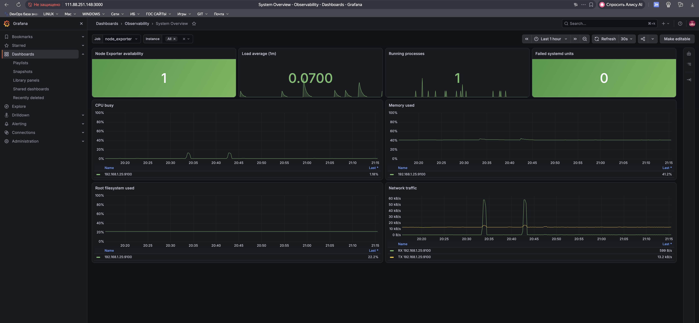
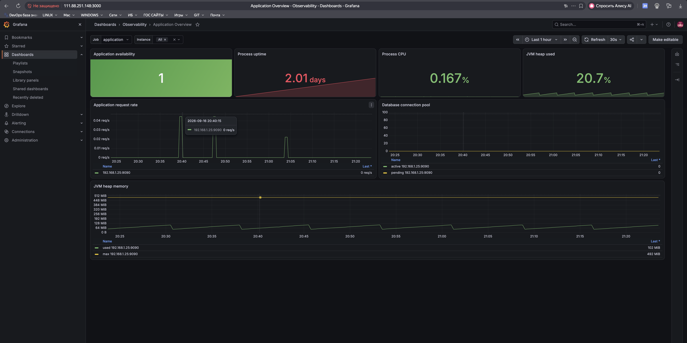
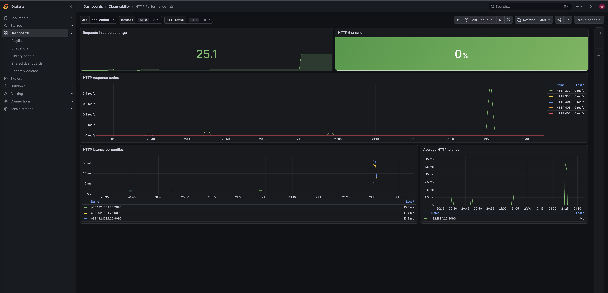
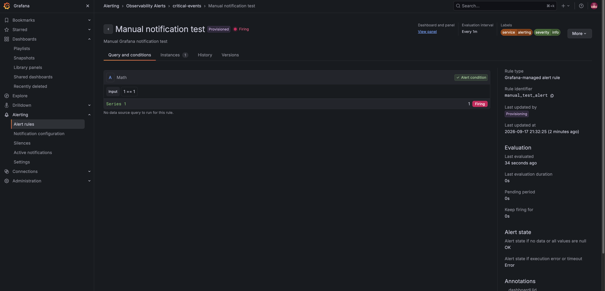

# Доска объявлений (Observability)

[](https://github.com/Absaidov/devops-engineer-from-scratch-project-318/actions)
[](https://github.com/Absaidov/project-devops-deploy/actions/workflows/main.yml)

Учебный проект Хекслета по развёртыванию и последующему мониторингу
контейнеризированного приложения «Доска объявлений» в Yandex Cloud.

Приложение доступно по адресам:

- [https://uit14.ru](https://uit14.ru)
- [https://www.uit14.ru](https://www.uit14.ru)

Публичный IP сервера приложения: `89.169.153.112`.
Публичный IP сервера наблюдаемости: `111.88.251.148`.

## Приложение и Docker-образ

Исходный код находится в отдельном
[форке приложения](https://github.com/Absaidov/project-devops-deploy). В нём
находятся Dockerfile и CI/CD workflow, который запускает тесты, собирает образ и
публикует его в Yandex Container Registry с неизменяемым тегом — полным SHA
коммита.

Текущий образ:

```text
cr.yandex/crphrkv4imihhuukiv7q/project-devops-deploy:a100ed36995989034cee26c2cfd9e1558201bdaa
```

Для проверки локальной сборки клонируйте форк приложения и выполните в нём:

```bash
make docker-build
```

## Инфраструктура

Инфраструктура проекта в Yandex Cloud включает:

- виртуальная машина с Ubuntu 24.04 LTS;
- отдельная виртуальная машина для сервисов наблюдаемости;
- Managed Service for PostgreSQL с базой `bulletins`;
- закрытый бакет Object Storage `uit14-bulletins-images`;
- Yandex Container Registry с образом приложения;
- DNS-записи `uit14.ru` и `www.uit14.ru`;
- Nginx и сертификат Let's Encrypt.

PostgreSQL доступен только с внутреннего IP сервера приложения. Бакет закрыт,
а приложение обращается к нему от имени отдельного сервисного аккаунта.

### Карта стенда, портов и доступов

| Компонент | Узел / адрес | Порт и URL | Кто имеет доступ |
|---|---|---|---|
| Приложение | `89.169.153.112`, приватный `192.168.1.25` | [https://uit14.ru](https://uit14.ru), TCP `443`; TCP `80` только для редиректа | интернет |
| SSH приложения | `89.169.153.112` | TCP `22` | доверенный публичный `/32` |
| Actuator через Nginx | `192.168.1.25` | TCP `9090`, `/actuator/health/*`, `/actuator/prometheus` | только `192.168.1.15/32`, метрики защищены Basic Auth |
| Node Exporter | `192.168.1.25` | TCP `9100`, `/metrics` | только `192.168.1.15/32` |
| Nginx Exporter | `192.168.1.25` | TCP `9113`, `/metrics` | только `192.168.1.15/32` |
| Prometheus | `111.88.251.148`, приватный `192.168.1.15` | [http://111.88.251.148:9090](http://111.88.251.148:9090), TCP `9090` | проверяющий и доверенные адреса |
| Grafana | `111.88.251.148`, приватный `192.168.1.15` | [http://111.88.251.148:3000](http://111.88.251.148:3000), TCP `3000` | проверяющий и доверенные адреса |
| Loki | `192.168.1.15` | TCP `3100` | только сервер приложения `192.168.1.25/32` |
| Managed PostgreSQL | `rc1a-ths7ptdlvrtqlvfl.mdb.yandexcloud.net` | TCP `6432`, БД `bulletins` | только сервер приложения |
| Object Storage | `storage.yandexcloud.net` | HTTPS `443`, бакет `uit14-bulletins-images` | сервисный аккаунт приложения |

Канал оповещений — contact point Grafana `operations-email` через SMTP Яндекс
Почты (`smtp.yandex.ru:465`). Адрес и пароль приложения хранятся только в
Ansible Vault.

## Требования

### Управляющий компьютер

- Linux, macOS или Windows с WSL;
- Python 3.12 или новее с модулем `venv`, Make, Git, cURL и SSH-клиент;
- SSH-ключ для пользователя `ubuntu` на целевом сервере;
- пароль от Ansible Vault;
- доступ в интернет для установки Python-зависимостей, ролей и коллекций
  Ansible.

Команда `make install` создаёт локальное окружение `.venv` и устанавливает в
него закреплённые версии Ansible Core и `ansible-lint`; глобальная установка
Ansible не требуется.

### Сервер приложения

- Ubuntu 24.04 LTS, Python 3, `apt` и SSH;
- пользователь с правами `sudo` без запроса пароля;
- исходящий доступ к Container Registry, PostgreSQL и Object Storage;
- открытые входящие TCP-порты `22`, `80` и `443`;
- TCP-порты `9090`, `9100` и `9113`, разрешённые только с внутреннего адреса
  сервера мониторинга;
- исходящий доступ к приватному адресу сервера наблюдаемости на TCP-порт
  `3100` для отправки логов Promtail;
- доступ к Managed PostgreSQL внутри облачной сети.

Docker, Docker Compose, Git, cURL, UFW, Node Exporter, rsyslog и необходимые
Python-библиотеки устанавливаются подготовительным playbook. Nginx, Certbot
и контейнеры Nginx Prometheus Exporter и Promtail настраиваются во время
деплоя.

### Сервер наблюдаемости

- отдельная ВМ с Ubuntu 24.04 LTS в той же облачной сети, что и приложение;
- статический публичный IPv4 и приватный IPv4 этой ВМ;
- Python 3, `apt`, SSH и пользователь с правами `sudo`;
- входящий TCP-порт `22` для управления, `9090` для интерфейса Prometheus и
  `3000` для интерфейса Grafana;
- входящий TCP-порт `3100` только с приватного адреса сервера приложения;
- исходящий доступ к Docker Hub и к приватному IP приложения на TCP-портах
  `9090`, `9100` и `9113`.

Docker, UFW, конфигурация и контейнеры Prometheus, Loki и Grafana
устанавливаются командой `make monitoring-deploy`.

## Развёртывание с нуля

1. Сделайте fork репозитория приложения, убедитесь, что его CI публикует
   Docker-образ в Container Registry, затем клонируйте этот инфраструктурный
   репозиторий.
2. Создайте в одной VPC две ВМ Ubuntu 24.04 LTS: `app-server` и
   `monitoring-server`. Назначьте им статические публичные и приватные адреса.
3. Создайте Managed PostgreSQL, закрытый бакет Object Storage, Container
   Registry и отдельные сервисные аккаунты с минимальными правами. Сохраните
   выданные ключи только до их помещения в Vault.
4. Добавьте публичный SSH-ключ пользователю `ubuntu` обеих ВМ и проверьте вход
   по ключу. В Security Groups разрешите порты строго по таблице выше.
5. Создайте A-записи домена на публичный IP `app-server`; дождитесь, пока
   `dig +short A <domain>` начнёт возвращать этот адрес.
6. Создайте локальный inventory, выполните `make install`, затем заполните
   открытые переменные и создайте Vault-файлы по примерам.
7. Подготовьте сервер приложения, разверните приложение и после него стек
   наблюдаемости.
8. Запустите статические и сквозные проверки. Финальный `make smoke` должен
   завершиться без `failed` и `unreachable`.

Все команды ниже выполняются из корня репозитория. Сначала создайте локальный
inventory:

```bash
cp ansible/inventory.ini.example ansible/inventory.ini
```

Заполните публичные и приватные адреса обеих ВМ:

```ini
[app]
app-server ansible_host=<app-public-ip> private_ip=<app-private-ip> ansible_user=ubuntu ansible_port=22

[monitoring]
monitoring-server ansible_host=<monitoring-public-ip> private_ip=<monitoring-private-ip> ansible_user=ubuntu ansible_port=22
```

`ansible_host` используется Ansible для SSH, а `private_ip` — для сбора метрик
внутри облачной сети. Локальный `ansible/inventory.ini` игнорируется Git.

Установите локальное Python-окружение, Ansible, линтер, роли и коллекции:

```bash
make install
```

Секреты приложения зашифрованы по отдельности в
`ansible/group_vars/app/vault.yml`. Общий пароль, с которым Prometheus
обращается к защищённому Actuator endpoint, находится в
`ansible/group_vars/all/vault.yml`. Структура переменных показана в соседних
файлах `vault.yml.example`. Пароль Vault, JSON-ключи и незашифрованные секреты
хранить в репозитории нельзя.

Для Basic Auth management endpoint создайте отдельный пароль:

```bash
make vault-encrypt
```

В строке `Variable name` укажите
`vault_monitoring_basic_auth_password`, затем введите новый пароль для
пользователя мониторинга. Добавьте полученный YAML-блок в
`ansible/group_vars/all/vault.yml`. Используйте тот же пароль Ansible Vault,
которым уже зашифрованы остальные значения.

Пароль администратора Grafana хранится в
`ansible/group_vars/monitoring/vault.yml`. Создайте его командой:

```bash
make vault-encrypt
```

В строке `Variable name` укажите `vault_grafana_admin_password`, затем
введите придуманный пароль администратора Grafana. Для шифрования используйте
тот же пароль Ansible Vault. Полученный YAML-блок добавьте в
`ansible/group_vars/monitoring/vault.yml`. Открытое значение пароля и файл с
паролем расшифровки добавлять в репозиторий нельзя.

### Переменные окружения и Vault

Открытые настройки хранятся только в `group_vars`, а роли получают их через
переменные. Основные группы настроек:

| Файл | Настройки |
|---|---|
| `ansible/group_vars/all/vars.yml` | общие порты и имя пользователя Basic Auth |
| `ansible/group_vars/app/vars.yml` | домен, образ и тег приложения, PostgreSQL host/port/database/SSL, S3 endpoint/bucket/region, порты Nginx и экспортеров |
| `ansible/group_vars/monitoring/vars.yml` | закреплённые образы Prometheus/Loki/Grafana, scrape targets, retention, UI-порты, SMTP host, дашборды и alert rules |

Секретные переменные создаются по соседним `vault.yml.example` и сохраняются
в соответствующих `vault.yml` только в зашифрованном виде:

| Vault-файл | Обязательные переменные |
|---|---|
| `ansible/group_vars/all/vault.yml` | `vault_monitoring_basic_auth_password` |
| `ansible/group_vars/app/vault.yml` | `vault_yc_registry_key`, `vault_db_username`, `vault_db_password`, `vault_s3_access_key`, `vault_s3_secret_key` |
| `ansible/group_vars/monitoring/vault.yml` | `vault_grafana_admin_password`, `vault_grafana_smtp_user`, `vault_grafana_smtp_password` |

Во время деплоя роль создаёт файлы окружения приложения и миграций из
Jinja2-шаблонов `application.env.j2` и `migration.env.j2`. Локальные `.env`,
пароль Vault и исходные JSON-ключи игнорируются Git и не должны попадать в
коммиты или вывод CI.

Список адресов, которым разрешено собирать метрики, формируется автоматически
из приватных IP группы `monitoring` в inventory. В Security Group сервера
приложения разрешите TCP `9090`, `9100` и `9113` только с приватного IP
сервера наблюдаемости `/32`. Не открывайте эти порты для `0.0.0.0/0`.

## Команды

Все команды запускаются из корня репозитория.

Создать `.venv` и установить зафиксированные версии Ansible Core,
`ansible-lint`, ролей и коллекций:

```bash
make install
```

Запустить `ansible-lint` с базовым профилем:

```bash
make lint
```

Запустить линтер и проверку синтаксиса всех playbook:

```bash
make test
```

Отдельно проверить только синтаксис playbook:

```bash
make syntax
```

Подготовить новый сервер:

```bash
make prepare
```

Развернуть текущий образ приложения:

```bash
make deploy
```

Подготовить ВМ наблюдаемости и развернуть Prometheus, Loki и Grafana одной
командой:

```bash
make monitoring-deploy
```

Команда устанавливает Docker и UFW, проверяет конфигурацию и alert rules через
`promtool`, создаёт сеть `monitoring`, запускает контейнеры и ожидает готовности
Prometheus и Loki. Она также применяет provisioning datasource'ов и дашбордов
Grafana, поэтому этой же командой обновляются дашборды после изменения их
JSON-файлов. Перед запуском Prometheus playbook обновляет UFW и
management-конфигурацию Nginx на сервере приложения, используя приватный адрес
группы `monitoring`. Повторный запуск идемпотентен.

Развернуть новый образ по полному SHA коммита:

```bash
make deploy IMAGE_TAG=<full-commit-sha>
```

Откатиться на предыдущий стабильный образ:

```bash
make rollback IMAGE_TAG=<previous-full-commit-sha>
```

Роль не принимает изменяемые теги наподобие `latest`.

После полного развёртывания выполнить единую smoke-проверку:

```bash
make smoke
```

Она проверяет SSH/Ansible-доступ к обеим ВМ, HTTPS-страницу, статический
`manifest.json`, REST API, readiness приложения, конфигурацию и targets
Prometheus, datasource'ы/дашборды/алерты Grafana и доставку тестовых логов
Nginx и приложения через Promtail в Loki. Во время проверки потребуется один
раз ввести пароль Ansible Vault для Grafana API.

## Проверка приложения и логов

Проверить главную страницу, статический `manifest.json` и REST API через
публичный HTTPS-адрес:

```bash
make check
```

Проверить readiness endpoint на локальном management-порту сервера:

```bash
make health
```

Показать последние 100 строк stdout контейнера:

```bash
make logs
```

Проверить доступность метрик приложения и Node Exporter с управляющего
компьютера через Ansible:

```bash
make metrics
make node-metrics
```

Playbook деплоя также автоматически ожидает успешный ответ
`/actuator/health/readiness` перед настройкой Nginx и проверяет редирект с HTTP
на HTTPS.

JSON-логи приложения сохраняются на сервере в
`/srv/project-devops-deploy/logs/application.log` и переживают замену
контейнера. Данные приложения находятся в Managed PostgreSQL, а изображения —
в Object Storage.

## Node Exporter и метрики приложения

Подготовительный playbook устанавливает Node Exporter как systemd-сервис и
включает дополнительные коллекторы `systemd` и `processes`. Его endpoint —
`http://<app-host>:9100/metrics`. Доступ к порту ограничивается UFW и Security
Group адресом сервера мониторинга.

Actuator внутри контейнера работает на порту `9090`, опубликованном на сервере
только как `127.0.0.1:19090`. Nginx слушает management-порт `9090` и
проксирует только следующие защищённые Basic Auth адреса:

- `/actuator/prometheus`;
- `/actuator/health`;
- `/actuator/health/liveness`;
- `/actuator/health/readiness`.

Остальные Actuator endpoint, включая `/actuator/logfile`, через Nginx не
доступны. Имя пользователя задаётся открытой переменной
`monitoring_basic_auth_username`, пароль хранится только в Ansible Vault.

### Обязательные метрики

| Источник | Что контролируем | Метрики Prometheus |
|---|---|---|
| Node Exporter | CPU и load average | `node_cpu_seconds_total`, `node_load1`, `node_load5`, `node_load15` |
| Node Exporter | Память | `node_memory_MemTotal_bytes`, `node_memory_MemAvailable_bytes` |
| Node Exporter | Файловые системы | `node_filesystem_size_bytes`, `node_filesystem_avail_bytes` |
| Node Exporter | Операции с дисками | `node_disk_read_bytes_total`, `node_disk_written_bytes_total` |
| Node Exporter | Сеть | `node_network_receive_bytes_total`, `node_network_transmit_bytes_total` |
| Node Exporter | Процессы | `node_procs_running`, `node_procs_blocked`, `node_processes_pids`, `node_processes_state` |
| Node Exporter | Системные сервисы | `node_systemd_unit_state`, `node_systemd_service_restart_total` |
| Node Exporter | Сам exporter | `node_exporter_build_info`, `node_scrape_collector_success` |
| Приложение | Запуск и доступность | `process_uptime_seconds`, `application_started_time_seconds`, `application_ready_time_seconds` |
| Приложение | CPU | `process_cpu_usage`, `system_cpu_usage`, `system_load_average_1m` |
| Приложение | JVM и сборка мусора | `jvm_memory_used_bytes`, `jvm_gc_pause_seconds_count`, `jvm_gc_pause_seconds_sum` |
| Приложение | HTTP-запросы | `http_server_requests_seconds_count`, `http_server_requests_seconds_sum`, `http_server_requests_seconds_bucket` |
| Приложение | Пул соединений с БД | `hikaricp_connections_active`, `hikaricp_connections_pending`, `jdbc_connections_active` |
| Приложение | События логирования | `logback_events_total` |

### Проверка через curl

На сервере приложения можно проверить оба экспортера локально:

```bash
ssh ubuntu@89.169.153.112
curl --fail http://127.0.0.1:9100/metrics
curl --fail http://127.0.0.1:19090/actuator/prometheus
curl --fail http://127.0.0.1:19090/actuator/health/readiness
```

Проверка именно через Nginx на management-порту (команда запросит пароль
Basic Auth):

```bash
curl --fail --user prometheus http://127.0.0.1:9090/actuator/prometheus
curl --fail --user prometheus http://127.0.0.1:9090/actuator/health/readiness
```

С сервера мониторинга вместо `127.0.0.1` используется внутренний IP сервера
приложения. Это сработает после добавления его `/32` в UFW и Security Group.

Access-логи Nginx записываются в JSON по путям
`/var/log/nginx/access-json.log` и
`/var/log/nginx/management-access-json.log`. Нативный error log Nginx
направляется в локальный syslog, а rsyslog преобразует каждую запись в JSON и
сохраняет её в `/var/log/nginx/error-json.ndjson`.

## Сервер наблюдаемости: Prometheus

Prometheus разворачивается отдельной ролью
`ansible/roles/prometheus`. Используется зафиксированный Docker-образ
`prom/prometheus:v3.14.0` и отдельная bridge-сеть `monitoring` для последующего
подключения Grafana и Alertmanager.

Данные и конфигурация разделены:

- `/etc/prometheus` — сгенерированный `prometheus.yml`, alert rules и их тест;
- `/var/lib/prometheus` — постоянные данные TSDB, переживающие замену
  контейнера.

Пароль Basic Auth извлекается из Vault в отдельный файл с ограниченными
правами; в `prometheus.yml` хранится только путь к этому файлу.

Список scrape jobs находится в
`ansible/group_vars/monitoring/vars.yml`. Адрес приложения берётся из
`private_ip` группы `app`, поэтому для добавления новой ВМ не требуется вручную
править шаблон Prometheus.

| Job | Target | Endpoint | Авторизация |
|---|---|---|---|
| `prometheus` | сам контейнер | `/metrics` | нет |
| `node_exporter` | приватный IP приложения, порт `9100` | `/metrics` | ограничение по IP |
| `application` | приватный IP приложения, порт `9090` | `/actuator/prometheus` | Basic Auth, пароль из Vault |
| `nginx` | приватный IP приложения, порт `9113` | `/metrics` | ограничение по IP |

Интерфейс и список scrape targets доступны по адресам:

- [http://111.88.251.148:9090/graph](http://111.88.251.148:9090/graph)
- [http://111.88.251.148:9090/targets](http://111.88.251.148:9090/targets)

В интерфейсе выполните запрос:

```promql
up
```

Для jobs `prometheus`, `node_exporter`, `application` и `nginx` ожидается
значение `1`.
То же самое можно проверить с управляющего компьютера:

```bash
make prometheus-check
```

Проверить рабочую конфигурацию и unit-тест alert rule:

```bash
make prometheus-config-check
```

Посмотреть последние строки JSON-логов контейнера:

```bash
make prometheus-logs
```

Alert rule `TargetDown` срабатывает, если любой scrape target остаётся
недоступным больше двух минут. Файл правила и тест для `promtool test rules`
хранятся в роли вместе с кодом.

На ВМ наблюдаемости Security Group должна разрешать только:

- TCP `22` с доверенного публичного IP для SSH;
- TCP `9090` с адресов, которым нужен интерфейс Prometheus;
- TCP `3000` с адресов, которым нужен интерфейс Grafana;
- TCP `3100` только с приватного адреса сервера приложения `192.168.1.25/32`;
- исходящий трафик для загрузки пакетов и сбора метрик.

Чтобы проверяющий мог открыть `/graph`, можно разрешить входящий TCP `9090` из
`0.0.0.0/0`. В этом случае наружу открыт только сам сервис Prometheus. Для
закрытого варианта укажите публичные `/32` проверяющего и управляющего
компьютера. Опубликованные Docker-порты могут обходить правила UFW, поэтому
Security Group Yandex Cloud остаётся обязательной границей доступа. Не
прикрепляйте одновременно разрешающую всё Security Group.

## Grafana: визуализация метрик

Grafana работает на той же ВМ, что и Prometheus, и подключена к общей
Docker-сети `monitoring`. Интерфейс доступен по адресу:

- [http://111.88.251.148:3000](http://111.88.251.148:3000)

Имя администратора — `admin`. Пароль находится только в Ansible Vault в
переменной `vault_grafana_admin_password` и в README не публикуется.

Данные Grafana сохраняются в `/var/lib/grafana`, provisioning-файлы — в
`/etc/grafana/provisioning`, а исходные JSON-файлы дашбордов — в
`/etc/grafana/dashboards`. Эти каталоги подключаются к контейнеру отдельными
bind mounts, поэтому база Grafana переживает замену контейнера, а конфигурация
остаётся управляемой Ansible.

Datasource'ы создаются автоматически с помощью provisioning YAML:

- `Prometheus` обращается к `http://prometheus:9090` внутри Docker-сети и
  используется по умолчанию;
- `Loki` обращается к `http://loki:3100` внутри той же закрытой Docker-сети.

Provisioning создаёт шесть дашбордов:

| UID | Назначение |
|---|---|
| `system-overview` | CPU, load average, память, файловые системы и сеть сервера приложения |
| `application-overview` | доступность приложения, uptime, CPU процесса и память JVM |
| `http-performance` | частота HTTP-ответов по label `status` и перцентили p50, p95, p99 |
| `status-page` | сводное состояние сервисов и текущие alert rules |
| `nginx-overview` | доступность Nginx, RPS и состояния соединений |
| `logs-overview` | HTTP 5xx и latency из Nginx JSON-логов, логи приложения и поиск по пользователю |

Дашборды метрик используют переменные `$job` и `$instance`, а dashboard логов
— `$env`, `$host` и `$user`. Панель кодов ответа строится на
`http_server_requests_seconds_count` с группировкой по `status`, а latency —
через `histogram_quantile()` по `http_server_requests_seconds_bucket`.

Развернуть или обновить Grafana и provisioned dashboards:

```bash
make grafana-update
```

Эта цель вызывает общий идемпотентный `make monitoring-deploy`, поэтому
Prometheus остаётся работающим, а Grafana перезапускается только при реальном
изменении конфигурации, пароля или JSON-файлов дашбордов.

Проверить health API Grafana, datasource'ы Prometheus и Loki и наличие всех
дашбордов:

```bash
make grafana-check
```

Посмотреть последние строки логов контейнера Grafana:

```bash
make grafana-logs
```

В Security Group ВМ наблюдаемости разрешите входящий TCP `3000` с доверенного
публичного адреса `/32`. Если интерфейс должен открыть наставник с заранее
неизвестного адреса, порт можно временно разрешить для `0.0.0.0/0`, а после
проверки снова ограничить. На сервере приложения порт `3000` открывать не
нужно.

### Скриншоты дашбордов

Системные ресурсы:



Состояние приложения:



HTTP-коды и latency:



## Алертинг в Grafana

Grafana-managed alert rules, email contact point и notification policy
создаются автоматически из файлов в
`ansible/roles/monitoring/templates`. Они синхронизируются вместе с
дашбордами командой:

```bash
make grafana-update
```

Правила оцениваются раз в минуту. Для кратковременных всплесков используется
состояние `Pending` (`for`), а каждое правило содержит labels `service` и
`severity`.

| Правило | Условие | `for` | Labels | Связанная панель |
|---|---|---:|---|---|
| `application_down` | target приложения недоступен | 2 минуты | `application`, `critical` | Application Overview |
| `application_http_5xx_high` | доля HTTP 5xx выше 5% | 5 минут | `application`, `critical` | HTTP Performance |
| `application_latency_high` | HTTP p95 выше 1 секунды | 5 минут | `application`, `warning` | HTTP Performance |
| `node_cpu_high` | CPU выше 85% | 10 минут | `application-host`, `warning` | System Overview |
| `node_memory_high` | RAM выше 90% | 10 минут | `application-host`, `warning` | System Overview |
| `node_root_disk_high` | корневая файловая система заполнена более чем на 85% | 10 минут | `application-host`, `warning` | System Overview |
| `application_metrics_missing` | нет `process_uptime_seconds` более 5 минут | 1 минута после окна | `application-metrics`, `critical` | Status Page |

HTTP 5xx вычисляются только по метрике приложения
`http_server_requests_seconds_count{status=~"5.."}`. На дашборде
`Observability / Status Page` собраны доступность приложения, 5xx, latency,
CPU, RAM, диск, наличие метрик и текущие состояния алертов.

### Почтовые уведомления

Contact point `operations-email` использует Яндекс Почту через
`smtp.yandex.ru:465`. Обычный пароль от почты использовать нельзя: в
Яндекс ID необходимо создать отдельный пароль приложения для почтового
клиента.

В `ansible/group_vars/monitoring/vault.yml` должны находиться только
зашифрованные значения:

- `vault_grafana_smtp_user` — полный адрес Яндекс Почты; он же получатель;
- `vault_grafana_smtp_password` — пароль приложения Яндекс Почты.

На ВМ они записываются в защищённые файлы и передаются контейнеру через
`GF_SMTP_USER__FILE` и `GF_SMTP_PASSWORD__FILE`. Пароль не попадает в
репозиторий, provisioning YAML или вывод Ansible.

После добавления секретов разверните конфигурацию и проверьте все
provisioned-ресурсы:

```bash
make grafana-update
make grafana-alerting-check
```

Правила находятся в Grafana в разделе
`Alerts & IRM → Alerting → Alert rules`, а contact point — в
`Alerts & IRM → Alerting → Notification configuration → Contact points`.
На странице `operations-email` кнопка `Test` отправляет тестовое письмо и
проверяет SMTP.

Для воспроизводимой end-to-end проверки правила и маршрутизации предусмотрен
синтетический алерт, который в обычном деплое находится в состоянии `Normal`:

```bash
make grafana-alert-test
```

Подождите до 90 секунд, убедитесь, что `Manual notification test` перешёл в
`Firing` и письмо пришло. Затем обязательно верните правило в нормальное
состояние:

```bash
make grafana-alert-test-reset
```

Проверка выполнена: правило перешло в состояние `Firing`, почтовое уведомление
было доставлено, а после `make grafana-alert-test-reset` правило вернулось в
состояние `Normal`.



## Nginx Prometheus Exporter

В конфигурации Nginx включён отдельный endpoint
`http://192.168.1.25:9090/nginx_status`. Он отдаёт стандартную страницу
`stub_status` и доступен только с localhost и приватных адресов группы
`monitoring`. Дополнительно порт `9090` закрыт UFW и Security Group от всех
остальных источников.

Роль `ansible/roles/nginx_exporter` запускает официальный закреплённый образ
`nginx/nginx-prometheus-exporter:1.5.1` в Docker с политикой перезапуска
`unless-stopped`. Экспортер читает локальный `stub_status` и публикует
Prometheus-метрики на порту `9113`. UFW разрешает этот порт только приватным
адресам серверов мониторинга. В Security Group сервера приложения также
должно быть входящее правило TCP `9113` с источником `192.168.1.15/32`.

Сначала разверните изменения на сервере приложения, затем обновите стек
наблюдаемости:

```bash
make deploy
make monitoring-deploy
```

Проверить `stub_status` с ВМ наблюдаемости:

```bash
ssh ubuntu@111.88.251.148 \
  'curl -fsS http://192.168.1.25:9090/nginx_status'
```

В ответе должны присутствовать `Active connections`, `Reading`, `Writing` и
`Waiting`. Локальные проверки через Ansible и endpoint экспортера:

```bash
make nginx-status
make nginx-metrics
make nginx-exporter-logs
```

Проверить живую конфигурацию Prometheus через `promtool`, состояние всех
targets и наличие обязательных метрик:

```bash
make prometheus-config-check
make prometheus-check
```

В Prometheus ожидаются следующие запросы:

```promql
up{job="nginx"}
nginx_up{job="nginx"}
nginx_connections_active{job="nginx"}
nginx_http_requests_total{job="nginx"}
```

Для них ожидаются непустые результаты, а для `up` и `nginx_up` — значение
`1`. Метрики отображаются на provisioned dashboard
[Nginx Overview](http://111.88.251.148:3000/d/nginx-overview/nginx-overview):
RPS вычисляется как `rate(nginx_http_requests_total[1m])`, отдельно показаны
активные, читающие, записывающие и ожидающие соединения.

Open Source Nginx `stub_status` не содержит разбивки HTTP-ответов по кодам и
времени обработки запросов. Поэтому панели status codes и latency продолжают
использовать метрики Spring Actuator на dashboard `HTTP Performance`.

## Централизованные логи: Promtail и Loki

Loki `3.7.8` работает на ВМ наблюдаемости в single-binary режиме и подключён
к Docker-сети `monitoring`. Конфигурация создаётся из Jinja2-шаблона, данные
хранятся в `/var/lib/loki` и переживают замену контейнера. Для учебного стенда
используются TSDB schema `v13`, локальное filesystem-хранилище и срок хранения
семь дней.

Порт Loki `3100` привязан только к приватному адресу `192.168.1.15`. UFW
разрешает подключение лишь с приватного адреса сервера приложения. В Security
Group ВМ наблюдаемости необходимо создать такое же входящее правило:

| Направление | Протокол | Порт | Источник |
|---|---|---:|---|
| входящий | TCP | `3100` | `192.168.1.25/32` |

Порт `3100` нельзя открывать для `0.0.0.0/0`: у Loki нет встроенного слоя
аутентификации. Чувствительных значений в конфигурации этой связки нет, поэтому
для Loki и Promtail новые секреты Vault не требуются. Grafana обращается к
Loki по адресу `http://loki:3100` внутри закрытой Docker-сети.

На сервере приложения роль `ansible/roles/promtail` запускает закреплённый
образ Promtail `3.6.11` с `restart_policy: unless-stopped`. Promtail читает
только stdout текущего контейнера приложения и JSON-файлы Nginx:

- `/var/log/nginx/access-json.log`;
- `/var/log/nginx/management-access-json.log`;
- `/var/log/nginx/error-json.ndjson`.

Проверка живого сервера подтвердила, что stdout приложения содержит JSON
Logback внутри Docker `json-file`, а перечисленные логи Nginx также являются
JSON. Конвейеры Promtail разбирают внешний Docker envelope и внутренний JSON,
не добавляя в индекс высококардинальные поля вроде URL, request ID или имени
пользователя.

Каждый поток получает обязательные labels `job`, `env`, `app` и `host`.
Для приложения используется `job="application"`; для Nginx — `job="nginx"`
и дополнительный label `log_type` со значениями `access`, `management` или
`error`.

Promtail объявлен Grafana устаревшим и с 2 марта 2026 года находится в статусе
EOL. В проекте он используется, потому что прямо указан в учебном задании;
образ закреплён на последней опубликованной версии, а для дальнейшего развития
стека следует перейти на Grafana Alloy.

### Развёртывание и проверка логов

Сначала разверните Loki на ВМ наблюдаемости, затем Promtail на сервере
приложения:

```bash
make monitoring-deploy
make deploy
```

Проверить readiness Loki с сервера приложения можно по приватной сети:

```bash
ssh ubuntu@89.169.153.112 \
  'curl --fail http://192.168.1.15:3100/ready'
```

Автоматическая end-to-end проверка создаёт маркированный HTTP-запрос через
Nginx и JSON-маркер в stdout контейнера приложения, ждёт появления обеих
записей в Loki и проверяет обязательные labels:

```bash
make loki-check
```

Логи самих агентов и хранилища доступны командами:

```bash
make promtail-logs
make loki-logs
```

Provisioned dashboard доступен в Grafana:

- [Logs Overview](http://111.88.251.148:3000/d/logs-overview/logs-overview)

Он содержит сохранённые LogQL-запросы для всплесков HTTP 5xx, p95 latency,
логов приложения, ошибок Nginx и текстового поиска по пользователю. Аналогичные
запросы можно выполнить в `Explore`:

```logql
{job="application", env="prod"}
{job="nginx", log_type="access"} | json | status >= 500 and status < 600
quantile_over_time(0.95, {job="nginx", log_type="access"} | json | unwrap request_time | __error__="" [5m])
{job=~"application|nginx"} |~ "(?i)<user>"
```

## Финальная проверка

Проверяющий может воспроизвести статические и живые проверки двумя командами:

```bash
make test
make smoke
```

Ожидаемый результат: обе ВМ отвечают `pong`, публичная страница, статический
файл и REST API возвращают успешный ответ, все Prometheus targets имеют
`up == 1`, Grafana видит Prometheus и Loki, а тестовые записи приложения и
Nginx находятся в Loki. После этого в Grafana следует открыть дашборды
`System Overview`, `Application Overview`, `HTTP Performance`,
`Nginx Overview` и `Logs Overview`.

Почтовый канал проверяется отдельно командами `make grafana-alert-test` и
`make grafana-alert-test-reset`: сначала дождитесь состояния `Firing` и письма,
затем обязательно верните синтетический алерт в `Normal`. Подтверждающие
скриншоты дашбордов и алерта находятся в каталоге `assets/`.

## Структура Ansible

Все Ansible-файлы находятся в директории `ansible/`:

- `ansible/playbook.yml` — подготовка целевого сервера;
- `ansible/deploy.yml` — деплой приложения, Nginx и HTTPS;
- `ansible/prometheus.yml` — подготовка ВМ наблюдаемости и деплой Prometheus
  с Grafana;
- `ansible/prometheus-check.yml` — проверка конфигурации и scrape targets;
- `ansible/grafana-check.yml` — проверка Grafana, datasource'ов, дашбордов и
  alerting-ресурсов;
- `ansible/loki-check.yml` — сквозная проверка доставки JSON-логов в Loki;
- `ansible/roles/deploy/` — роль приложения и миграций;
- `ansible/roles/node_exporter/` — установка и настройка Node Exporter;
- `ansible/roles/nginx_exporter/` — контейнер Nginx Prometheus Exporter и
  проверка метрик Nginx;
- `ansible/roles/promtail/` — сбор stdout приложения и JSON-логов Nginx;
- `ansible/roles/prometheus/` — конфигурация, правила и контейнер Prometheus;
- `ansible/roles/loki/` — single-binary Loki и постоянное хранилище логов;
- `ansible/roles/monitoring/` — контейнер Grafana, datasource'ы, дашборды,
  alert rules, contact point и notification policy;
- `ansible/group_vars/all/` — общие настройки и зашифрованный пароль метрик;
- `ansible/group_vars/app/vars.yml` — открытые параметры окружения;
- `ansible/group_vars/monitoring/vars.yml` — параметры и scrape targets;
- `ansible/group_vars/monitoring/vault.yml` — зашифрованные пароли Grafana и
  SMTP;
- `ansible/group_vars/app/vault.yml` — зашифрованные секреты;
- `ansible/requirements.yml` — зафиксированные роли и коллекции;
- `ansible/templates/` — Jinja2-шаблон Nginx.

Конфигурация `ansible-lint` находится в `.ansible-lint`, а закреплённые
Python-зависимости для локального `.venv` — в `requirements-dev.txt`.

Все playbook идемпотентны: повторный запуск применяет только отсутствующие
изменения. Контейнеры приложения, Nginx Exporter, Promtail, Prometheus, Loki и
Grafana настроены с политикой перезапуска `unless-stopped`.

## Ссылки

- [Учебный проект Хекслета](https://ru.hexlet.io/programs/devops-engineer-from-scratch)
- [Демонстрация ожидаемой работы](https://asciinema.org/a/v4evn7XjCdou7Yh71IG0ljb0W)
